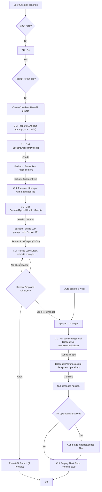

# CodeGen Cli

An AI-powered code editor designed to assist developers with intelligent code generation, refactoring, and general code manipulation directly within their project structure.

## Table of Contents

- [Features](#features)
- [Getting Started](#getting-started)
  - [Prerequisites](#prerequisites)
  - [Installation](#installation)
  - [Configuration](#configuration)
- [Usage](#usage)
  - [Running the Backend and Frontend](#running-the-backend-and-frontend)
  - [CLI Usage Examples](#cli-usage-examples)
- [CLI Workflow (Mermaid Diagram)](#cli-workflow-mermaid-diagram)
- [Project Structure](#project-structure)
- [Technologies Used](#technologies-used)
- [Contributing](#contributing)
- [License](#license)

## Features

- **AI-Powered Code Assistance**: Leverage large language models for code generation, refactoring, and debugging suggestions.
- **File Operations**: Seamless integration with local file systems for reading and writing code (delegated to backend).
- **Git Integration**: Basic Git operations (e.g., branch creation, diff generation, staging) to track changes locally.
- **User Interface**: A responsive web interface built with React to interact with the AI editor.
- **Authentication**: Secure user authentication for accessing the editor functionalities via OAuth.

## Getting Started

To get a copy of the project up and running on your local machine for development and testing purposes, follow these steps.

### Prerequisites

Before you begin, ensure you have the following installed:

- Node.js (LTS version recommended)
- npm or yarn
- Git
- **AI Editor Backend service running and accessible.**
  - The CLI communicates with this service for all AI and file system operations.
  - Visit https://github.com/evillan0315/project-board-server (or similar backend project) for setup instructions.

### Installation

1.  **Clone the repository:**

    ```bash
    git clone https://github.com/evillan0315/codegen-cli.git
    cd codegen-cli
    ```

2.  **Install dependencies for the CLI (root directory):**

    ```bash
    npm install
    # or yarn install
    ```

3.  **Install dependencies for the frontend (`apps/ai-editor-front`):**
    ```bash
    cd apps/ai-editor-front
    npm install
    # or yarn install
    cd ../..
    ```

### Configuration

Create a `.env` file in the project root (for the CLI) and in `apps/ai-editor-front` (for the frontend) based on the `.env.example` (if present) or refer to `docs/google-gemini-setup.md` for AI API key configuration (which applies to the backend).

Example `.env` (root, for CLI):

```env
PORT=3000
BACKEND_URL=http://localhost:5000 # Important for CLI to connect to the backend
# AI_API_KEY=YOUR_GEMINI_API_KEY # This is for the backend service, not the CLI
# AI_MODEL=gemini-pro
```

Example `.env` (`apps/ai-editor-front`):

```env
VITE_API_BASE_URL=http://localhost:5000/api
```

## Usage

### Running the Backend and Frontend

1.  **Start the backend server:**
    Follow the instructions for the AI Editor Backend service (e.g., `project-board-server` mentioned in prerequisites). It typically runs on `http://localhost:5000` (or your configured `PORT`).

2.  **Start the frontend development server:**
    From the `apps/ai-editor-front` directory:

    ```bash
    cd apps/ai-editor-front
    npm run dev
    ```

    The frontend application will typically open in your browser at `http://localhost:3000` (or Vite's default).

3.  **Access the AI Editor:**
    Navigate to the frontend URL in your web browser. You will be able to log in (if authentication is set up) and use the AI editing features.

### CLI Usage Examples

The AI Editor CLI (`aicli`) allows you to interact with the AI Editor backend directly from your terminal. Ensure your backend service is running and configured (see [Configuration](#configuration)).

For a full guide to all CLI commands and options, refer to the [CLI Usage Guide](docs/cli-usage.md).

**1. Authenticate with the Backend (Login)**

Before using `generate` or `scan`, you need to log in to the [Project Board Server](https://github.com/evillan0315/project-board-server) backend service. This command will open a browser for OAuth.

```bash
aicli login google
# or for GitHub
aicli login github

# Specify a different local port for the callback if 8080 is in use
aicli login google --port 8081
```

**2. Check Authenticated User**

Verify who is currently logged in.

```bash
aicli whoami
```

**3. Scan Project Files**

Scan files and directories to understand the project structure. This delegates to the backend.

```bash
# Scan the current directory and its subdirectories
aicli scan

# Scan specific files or directories
aicli scan src tests/unit

# Scan verbosely and show content snippets
aicli scan --verbose --show-content src/utils.ts
```

**4. Generate or Modify Code**

Instruct the AI to generate or modify code based on a natural language prompt via the backend LLM service. This is the core functionality.

```bash
# Generate code based on a prompt, scanning the current directory
aicli generate "Add a new utility function to src/utils.ts that formats dates as 'YYYY-MM-DD'."

# Generate code in a specific project root, scanning specific directories
aicli generate "Refactor the authentication logic in auth/ to use a new JWT strategy." --path /path/to/my/project --scan-dirs auth

# Auto-confirm all changes (USE WITH EXTREME CAUTION!)
aicli generate "Fix all linting errors in src/" --yes

# Generate changes without involving Git (no new branch, no staging)
aicli generate "Implement a new feature." --no-git

# Specify a custom branch name for Git operations
aicli generate "Improve performance of data processing" --branch perf-optimization-ai
```

**5. Log Out**

Clear your stored authentication token.

```bash
aicli logout
```

## CLI Workflow (Mermaid Diagram)



## Project Structure

```
ai-editor/
├── apps/
│   └── ai-editor-front/  # Frontend React application (separate repository/monorepo package)
│       ├── public/       # Static assets
│       ├── src/          # React components, hooks, pages, state management
│       └── ...
├── src/                  # AI Editor CLI Source Code
│   ├── auth/             # OAuth handling, token storage (authManager.ts)
│   ├── backend-api/      # Client for interacting with the NestJS backend (backend-api.ts)
│   ├── file-operations/  # Local diff generation, delegates file changes to backend (diffGenerator.ts, fileApplier.ts)
│   ├── git-operations/   # Local Git repository management (gitManager.ts)
│   ├── llm/              # LLM input/output types, JSON repair utility (jsonRepair.ts)
│   ├── cli.ts            # Main Commander.js CLI application entry point
│   ├── constants.ts      # Global constants, LLM instructions, expected output format
│   ├── scanner.ts        # (Deprecated/Unused: Original local file scanner logic, now delegated to backend)
│   └── types.ts          # Shared TypeScript interfaces and types
├── docs/                 # Project documentation (CLI usage, developer guide, setup)
├── .env                  # Environment variables for the CLI (e.g., BACKEND_URL)
├── .env.example          # Example environment variables
├── package.json          # Project metadata and dependencies
├── README.md             # Project overview, setup, and usage
├── tsconfig.json         # TypeScript configuration
└── ...                   # Other configuration files (eslint, prettier)
```

## Technologies Used

- **Backend (External)**: Node.js, NestJS, Google Gemini API, TypeORM, PostgreSQL, Passport.js (for OAuth)
- **Frontend**: React, TypeScript, Tailwind CSS, Vite
- **CLI**: Node.js, TypeScript, Commander.js, Inquirer.js, simple-git, axios, dotenv, chalk
- **AI**: Google Gemini API (via backend)
- **State Management (Frontend)**: Nanostores (or similar lightweight store)
- **Version Control**: Git

## Contributing

Please read `CONTRIBUTING.md` for details on our code of conduct, and the process for submitting pull requests to us.

## License

This project is licensed under the MIT License - see the `LICENSE` file for details.

## Author

Made with love by [Eddie Villanueva](https://github.com/evillan0315)  
📧 [evillan0315@gmail.com](mailto:evillan0315@gmail.com)
